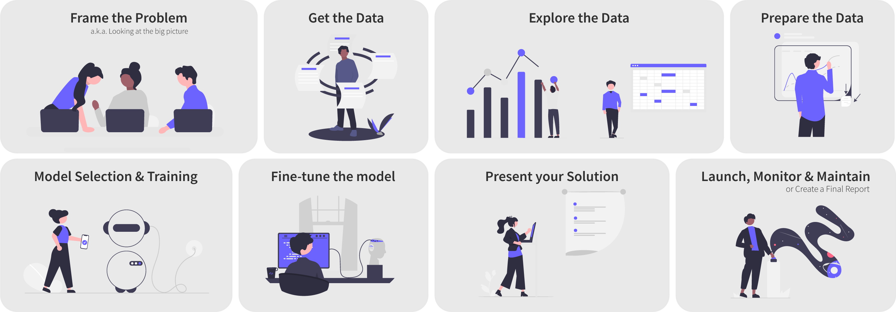

# Machine Learning - Home Credit Default Risk

## 🧾 Table of Contents
- [Machine Learning - Home Credit Default Risk](#machine-learning---home-credit-default-risk)
  - [🧾 Table of Contents](#-table-of-contents)
  - [👨🏻‍🏫 Introduction](#-introduction)
  - [🗺 Project](#-project)
  - [### 0. Framework](#-0-framework)
    - [1. Frame the Problem](#1-frame-the-problem)
  - [### Challenges and Solutions](#-challenges-and-solutions)
    - [2. Get the Data](#2-get-the-data)
  - [#### Challenges and Solutions](#-challenges-and-solutions-1)
    - [3. Exploratory Data Analysis](#3-exploratory-data-analysis)
  - [#### Challenges and Solutions](#-challenges-and-solutions-2)
    - [4. Prepare the data](#4-prepare-the-data)
  - [#### Pipeline](#-pipeline)
    - [5. Model Selection and Training](#5-model-selection-and-training)
  - [#### Models](#-models)
    - [6. Fine-tune the Model](#6-fine-tune-the-model)
  - [#### Final Model](#-final-model)
    - [7-8. Presenting the Solution](#7-8-presenting-the-solution)
      - [Final Report.md](#final-reportmd)
  - [## 🔧 Methods](#--methods)
  - [🗄 Reproducibility: Make and Folder Structure](#-reproducibility-make-and-folder-structure)
  - [#### To reproduce the project](#-to-reproduce-the-project)
  - [#### Folder Structure](#-folder-structure)
  - [📚 Learnings](#-learnings)
  - [🛣 Roadmap](#-roadmap)

## 👨🏻‍🏫 Introduction
[Home Credit](https://www.homecredit.net) is a multinational company with a simple business model: lend money. Generally, to customers with little or no credit history.

One of the cornerstones of their business model is the **predictive power of the data they possess**. They are making some of this data available online aiming to unlock its full potential, *a.k.a. deliver value from it*. In our case, we got a sample of this data to apply the data science/machine learning process on it with the intention to extract value from it and practice our learnings.

The main goal is to use the made-available data to predict if an applicant will have trouble to pay their debt. This objective is cascaded into:

1. Creating a Machine Learning model that is good at distinguishing between classes: in our case, distinguishing a good applicant to a loan from a bad one.
2. This is also a Learning-oriented Project, I intend to **experiment on various aspects of Machine Learning** - and have some fun.

*This project is a deliverable from the [Let's Code Data Science Degree](https://letscode.com.br/python-e-dados) Machine Learning III module.*

## 🗺 Project
### 0. Framework
------------

### 1. Frame the Problem
[1.0-ejk-framing-the-problem.ipynb](../notebooks/1.0-ejk-framing-the-problem.ipynb)

### Challenges and Solutions
------------

### 2. Get the Data
[2.0-ejk-getting-the-data.ipynb](../notebooks/2.0-ejk-getting-the-data.ipynb)

#### Challenges and Solutions
------------

### 3. Exploratory Data Analysis
[3.0-ejk-eda-applications.ipynb](../notebooks/3.0-ejk-eda-applications.ipynb)

#### Challenges and Solutions
------------

### 4. Prepare the data
[4.0-ejk-preparing-data-and-selecting-models.ipynb](../notebooks/4.0-ejk-preparing-data-and-selecting-models.ipynb)

#### Pipeline
------------

### 5. Model Selection and Training
[4.0-ejk-preparing-data-and-selecting-models.ipynb](../notebooks/4.0-ejk-preparing-data-and-selecting-models.ipynb)

#### Models
------------

### 6. Fine-tune the Model 
[5.0-ejk-fine-tunning-the-model.ipynb](../notebooks/5.0-ejk-fine-tunning-the-model.ipynb)

#### Final Model
------------

### 7-8. Presenting the Solution
#### [Final Report.md](Final%20Report.md)

## 🔧 Methods
------------

## 🗄 Reproducibility: Make and Folder Structure
#### To reproduce the project
------------

#### Folder Structure
------------

    ├── LICENSE
    ├── Makefile           <- Makefile with commands like `make data`
    ├── README.md          <- The top-level README for developers using this project.
    ├── data
    │   ├── interim        <- Intermediate and useful data.
    │   ├── processed      <- The final, canonical data sets for modeling.
    │   └── raw            <- The original, immutable data dump.
    │
    ├── models             <- Trained and serialized models or model summaries
    │
    ├── notebooks          <- Jupyter notebooks. Naming convention is a number (for ordering),
    │                         the creator's initials, and a short `-` delimited description, e.g.
    │                         `1.0-jqp-initial-data-exploration`.
    │
    ├── references         <- Data dictionaries, figures, manuals, and all other explanatory materials.
    │
    ├── reports            <- Generated analysis as Markdown, PDF, LaTeX, etc.
    │
    ├── requirements.txt   <- The requirements file for reproducing the analysis environment, e.g.
    │                         generated with `pip list --format=freeze > requirements.txt`
    │
    ├── setup.py           <- makes project pip installable (pip install -e .) so src can be imported
    ├── src                <- Source code for use in this project.
    │   ├── __init__.py    <- Makes src a Python module
    │   │
    │   ├── data           <- Scripts to download, generate, and explore data
    │   │
    │   ├── features       <- Scripts to turn raw data into features for modeling
    │   │
    │   ├── models         <- Scripts to train models and then use trained models to make predictions

## 📚 Learnings
- [Feature-engine Library](https://feature-engine.readthedocs.io) worked really well and was super important to the project.
- I learned a lot by using the [data science cookiecutter template](https://drivendata.github.io/cookiecutter-data-science/). Automating the steps with make and creating python files was essential to the reproducibility of the project.
- I guess it would be a good idea to had simpler annotations (an Excel would work great) with all the ideas of transformations and combinations I had for the Dataset to keep track of how each one of them would work. That would made me iterate faster and test more combinations for the final model.
- Further dividing Categorical Features into Binary, Nominal, and Ordinal, and Numeric Features into Discrete and Continuous would have helped me to get a more clear perspective going into the decisions.
- Due to the imbalanced target, I tested using many different sampling techniques (ADASYN, SMOTE, Random, TomekLinks). In all cases the models performed worse.
- Computational limitations:
  - Could not test more the data preparation phase (trying other transformers, passthrough some steps, combining more features) due to fitting time.
  - Could not use BayesSearchCV or GridSearchCV for hyperparameter tunning due to fitting time.
- I should have directed more efforts towards dimensional reduction and feature selection. That would have mitigated the computational limitations towards more experimenting.

## 🛣 Roadmap
- Use all datasets to combine multiple new features.
- Perform Feature Selection and Dimensional Reduction.
- Test Hyperparameter tunning with BayesSearchCV.